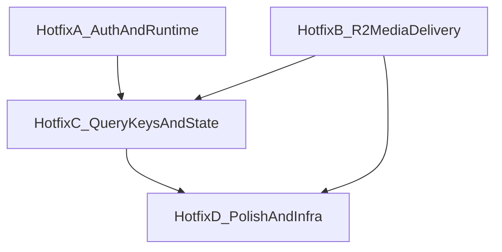

# Fix Backlog — feat/liquid-glass Audit

Ordered fix waves with dependencies. Each wave ends with: `tsc` → `bun test` → `npm run build` → Render smoke subset.

---

## Dependency Graph



**Rule:** Hotfix B must pick ONE media strategy (project-scoped routes + blob URLs). Do NOT also restore full `imageData` on list endpoints — that re-breaks perf wins and conflicts with Wave 1/2 intent.

---

## Hotfix A — Auth & Runtime Crashes (P0, ~1 day)

**Ship blocker. No dependency on other waves.**

| # | ID | Task | Files |
|---|-----|------|-------|
| A1 | SEC-001 | `await canAccessProject` in review room WebSocket upgrade | `server/review_room.ts` |
| A2 | SEC-002 | Add `canAccessProject` to AI agent check | `server/routes.ts:1680` |
| A3 | SEC-003 | Implement `getCommissionLineItem`, `getCommissionPricingPreset`, `getAudCaption` in storage | `server/storage.ts`, `server/routes.ts` |
| A4 | SEC-004 | Enforce `tokenVersion` in `requireAuth` / `getSessionUser` | `server/storage.ts`, `server/routes.ts`, `server/mcp_routes.ts` |
| A5 | A3-006 | Filter scene timer entries to requesting user | `server/routes.ts:1991`, `server/storage.ts` |
| A6 | DL-01 | Parse `?panel=` from wouter hash location | `StoryboardsTab.tsx` |

**Tests to add:**
- Review room: non-member gets 401 on WebSocket upgrade
- AI agent check: 403 for non-member project
- Commission line item PATCH: no TypeError

---

## Hotfix B — R2 Media Delivery (P0/P1, ~2–3 days)

**Depends on:** None (parallel with A). **Blocks:** all R2 panel visibility.

| # | ID | Task | Files |
|---|-----|------|-------|
| B1 | RC-1 | Add `GET /api/projects/:id/media?key=…` — `canAccessProject` + verify key belongs to project panel/asset | `server/routes.ts`, `server/storage.ts` |
| B2 | RC-1 | Add `GET /api/share/:token/media?key=…` — validate share token + resource ownership | `server/routes.ts` |
| B3 | RC-1 | Create `client/src/lib/panelMedia.ts` — `resolvePanelImageUrl(panel, ctx)` with authenticated fetch → blob URL cache | New file |
| B4 | MEDIA-012 | Migrate all storyboard consumers to shared resolver | review-room, couch-mode, compare, video-editor, animatic-editor, PanelPickerDialog, storyboard-reviewer, SpriteSheet, Share |
| B5 | MEDIA-002/003 | Replace `` in StoryboardsTab + Dashboard with resolver | `StoryboardsTab.tsx`, `Dashboard.tsx` |
| B6 | MEDIA-004/005 | Share + animatics: use full animatics list OR include `videoData`/`videoUrl` on share endpoint | `server/routes.ts`, `Share.tsx`, `ProjectWorkspace.tsx` AnimaticsTab |
| B7 | MEDIA-008–011 | Asset download presign for `r2Key`; extend `AssetSafe` type; fix AudioDialog `asset_ref` resolver | `server/routes.ts`, `AssetsTab.tsx`, `AudioDialog.tsx` |
| B8 | MEDIA-013–015 | Server export helpers: `loadPanelImageBuffer(panel)` with R2 fallback | `spritesheet_routes.ts`, `archive_routes.ts`, `routes/bak/index.ts` |
| B9 | COL-05 | Invalidate `["/api/production/queue"]` on panel create/bulk/delete | `StoryboardsTab.tsx`, `bulk-panel-import-dialog.tsx` |

**Deconfliction note:** B1–B3 are the foundation. B4–B5 must use the same helper — no per-file `/api/uploads/file` copies.

---

## Hotfix C — Query Keys & StoryboardsTab State (P1, ~1 day)

**Depends on:** Hotfix B (panel resolver stable before cache migration testing).

| # | ID | Task | Files |
|---|-----|------|-------|
| C1 | QK-01 | Migrate storyboard keys to `queryKeys.storyboards(id)` | video-editor, compare, couch-mode, review-room, SpriteSheet |
| C2 | QK-02 | Migrate comment keys to `queryKeys.comments(id)` | couch-mode, review-room |
| C3 | QK-03/04 | Normalize assets keys via `queryKeys.assets()` | AssetsTab, AudioDialog |
| C4 | SB-01 | Sync local `panels` from `board.panels` on every change, or derive from cache | `StoryboardsTab.tsx` |
| C5 | SB-02/MU-01 | Add `assertOk(res)` helper; reorder `onError` rollback + toast | `queryClient.ts`, `StoryboardsTab.tsx` |
| C6 | COL-09/10 | Update local `panels` in caption `onMutate` | `StoryboardsTab.tsx` |
| C7 | COL-11 | Pass `timerData` + `projectId` to `SceneTimerButton` | `ProjectWorkspace.tsx`, `scene-timer.tsx` |
| C8 | DI-01 | Remove dead `@dnd-kit` + unused lucide imports | `ProjectWorkspace.tsx` |

**Shared helper to add:**
```ts
// client/src/lib/assertOk.ts
export async function assertOk(res: Response): Promise<void> {
  if (!res.ok) throw new Error(`${res.status}: ${await res.text()}`);
}
```

---

## Hotfix D — Polish & Infra (P2, ~1 day)

**Depends on:** A + B + C complete.

| # | ID | Task | Files |
|---|-----|------|-------|
| D1 | COL-01/02 | Reset `data-liquid-ready` when liquidGL re-enables | `App.tsx` |
| D2 | A3-005 | `invalidateProjectAccess()` on member add/remove | `server/routes.ts` |
| D3 | A3-007/008 | Validate reorder permutation; filter `deletedAt` in lite panels | `server/storage.ts`, `server/routes.ts` |
| D4 | COL-13/14 | Bust `leaderboardCache` on reaction/submission writes | `server/challenge_routes.ts`, `challenge/index.tsx` |
| D5 | COL-16–18 | Prune `accessCache`, `leaderboardCache`, `commissionRateLimit` | `server/routes.ts`, `challenge_routes.ts` |
| D6 | A3-010 | Wire `checkAchievements` into `routes.ts` mutations | `server/routes.ts` |
| D7 | COL-06/07 | Bulk import: fix stale queue refs; rollback R2 on DB failure | `bulk-panel-import-dialog.tsx` |
| D8 | — | Pagination load-more for comments/assets (or document 50-item limit) | `ProjectWorkspace.tsx`, `AssetsTab.tsx` |
| D9 | — | Verify `reusePort` on Render; disable if listen fails | `server/index.ts` |

---

## PR Strategy

| Option | When |
|--------|------|
| **Single PR** `fix/audit-hotfixes` → `feat/liquid-glass` | Recommended if team can review ~3 days of fixes together |
| **Stacked PRs** A → B → C → D | If incremental deploy/testing preferred |

**Do not merge `feat/liquid-glass` → `main` until Hotfix A + B pass Render smoke.**

---

## Out of Scope (tracked separately)

- H7 full `imageData` → R2 backfill migration
- Dependabot vulnerability remediation (#58)
- tus/resumable uploads
- Further ProjectWorkspace tab extractions
- Full lazy-loading of all heavy routes (LZ-01)